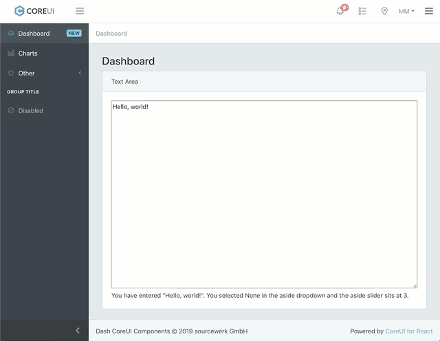

# dash-coreui-components

[CoreUI](https://coreui.io) components for Plotly Dash.

dash-coreui-components is a Dash component library.

`assets/` contains demo assets for the demo app `usage.py`.

**IMPORTANT:** If you want to use CoreUI Icons in your app (namespace `@coreui/icons`, you'll need to have `assets/fonts/CoreUI-Icons-Linear-Free.*` and `assets/css/coreui-icons.min.css`.

Get started with:
1. Install Dash and its dependencies: https://dash.plot.ly/installation
2. Run `./build_and_run.sh`. This will build the project in dev mode ans runs the example in `usage.py`.
3. Visit http://localhost:8050 in your web browser

The example in `usage.py` shows how to wire-up dash-coreui-components to a typical multi-page dashboard app.

## Contributing

Thank you for considering a contribution!
Pull requests are welcome.
Please see https://github.com/plotly/dash-component-boilerplate for information on the architecture of Dash components.

## Creating and Publishing Production Builds

Run `make_python_dist.sh` to create a Python package tarball.
This distribution tarball will get generated in the `dist/` folder.

# Acknowledgements

* [Plotly Dash](https://plot.ly/products/dash/)
* [CoreUI](https://coreui.io)
* [coreui-react](https://github.com/coreui/coreui-react)

